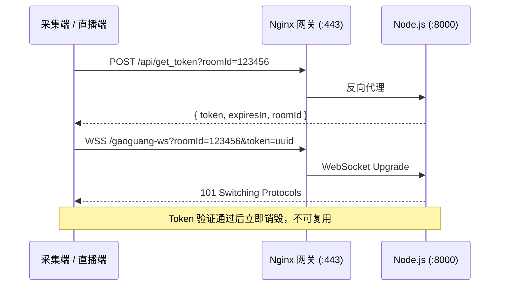

# 高光计分 V2 — 客户端对接文档

> 适用端：**采集端**（赛场 OCR 裁判端）、**直播端**（观众观看端）  
> 服务端版本：支持 `GET` / `POST` 双方法获取 Token（推荐 `POST`，用于绕过 Nginx 防火墙对 GET 的严格拦截）

---

## 1. 对接流程概览



---

## 2. 获取一次性 Token

### 2.1 接口说明

| 项目 | 说明 |
|------|------|
| **URL** | `https://api.mx.server.ndcoo.com/api/get_token?roomId={roomId}` |
| **方法** | `POST`（推荐）或 `GET` |
| **Query 参数** | `roomId` — 六位纯数字房间号，如 `123456` |
| **Request Body** | 无（POST 时 body 可为空，无需传 JSON） |
| **Token 有效期** | 60 秒，且**一次性使用**（WebSocket 握手成功后立即作废） |

### 2.2 请求示例（推荐 POST）

```javascript
/**
 * 获取 WebSocket 连接用的一次性 Token
 * @param {string} roomId - 六位房间号
 * @returns {Promise<{ token: string, expiresIn: number, roomId: string }>}
 */
function fetchToken(roomId) {
  return new Promise((resolve, reject) => {
    wx.request({
      url: `https://api.mx.server.ndcoo.com/api/get_token?roomId=${roomId}`,
      method: 'POST',
      header: {
        'Content-Type': 'application/json',
      },
      success(res) {
        if (res.statusCode === 200 && res.data && res.data.token) {
          resolve(res.data);
        } else {
          reject(new Error(res.data?.error || `HTTP ${res.statusCode}`));
        }
      },
      fail(err) {
        reject(err);
      },
    });
  });
}
```

### 2.3 成功响应

**HTTP 200**，`Content-Type: application/json`

```json
{
  "token": "550e8400-e29b-41d4-a716-446655440000",
  "expiresIn": 60,
  "roomId": "123456"
}
```

| 字段 | 类型 | 说明 |
|------|------|------|
| `token` | string | UUID 格式一次性令牌 |
| `expiresIn` | number | 有效秒数（固定 60） |
| `roomId` | string | 绑定的房间号 |

### 2.4 错误响应

**HTTP 400**，`Content-Type: application/json`

```json
{
  "error": "invalid roomId, expected 6-digit string"
}
```

常见原因：`roomId` 缺失、非六位、或包含非数字字符。

---

## 3. WebSocket 长连接

### 3.1 连接地址

```
wss://api.mx.server.ndcoo.com/gaoguang-ws?roomId={roomId}&token={token}
```

| Query 参数 | 必填 | 说明 |
|------------|------|------|
| `roomId` | 是 | 与获取 Token 时一致 |
| `token` | 是 | 上一步返回的 `token` |

### 3.2 连接示例

```javascript
/**
 * 建立 WebSocket 长连接
 * @param {string} roomId - 六位房间号
 * @param {string} token - 一次性 Token
 * @returns {WechatMiniprogram.SocketTask}
 */
function connectWebSocket(roomId, token) {
  const url =
    `wss://api.mx.server.ndcoo.com/gaoguang-ws?roomId=${roomId}&token=${encodeURIComponent(token)}`;

  const socketTask = wx.connectSocket({ url });

  socketTask.onOpen(() => {
    console.log('[ws] connected');
  });

  socketTask.onMessage((msg) => {
    const payload = JSON.parse(msg.data);
    // 按 type 分发，见下文
  });

  socketTask.onClose(() => {
    console.log('[ws] closed, schedule reconnect');
    // 指数退避重连：3s → 6s → 12s，上限 15s
  });

  return socketTask;
}
```

### 3.3 完整连接流程

```javascript
async function connectWithToken(roomId) {
  const { token } = await fetchToken(roomId);
  return connectWebSocket(roomId, token);
}
```

> **注意**：Token 必须在获取后 **60 秒内** 完成 WebSocket 握手；握手失败或过期需重新调用 `/api/get_token`。

---

## 4. 消息协议

所有 WebSocket 消息均为 **JSON 字符串**。

### 4.1 采集端 → 服务端（上行）

连接成功后，采集端发送状态更新：

```json
{
  "type": "COLLECTOR_UPDATE",
  "act": "START",
  "t": 599,
  "a": 89,
  "b": 85,
  "p": 1,
  "seq": 1001,
  "sys_t": 1715943242000,
  "match_id": "M_123456"
}
```

| 字段 | 类型 | 说明 |
|------|------|------|
| `type` | string | 固定 `"COLLECTOR_UPDATE"` |
| `act` | string | `START` / `STOP` / `SYNC` / `SCORE` / `S_RESET` / `PERIOD` |
| `t` | number | 大表剩余秒数（整数） |
| `a` | number | 主队得分 |
| `b` | number | 客队得分 |
| `p` | number | 节次（可选） |
| `seq` | number | 全局自增序列号，防乱序 |
| `sys_t` | number | 发包时刻 `Date.now()` |
| `match_id` | string | 比赛 ID（可选） |

### 4.2 直播端 → 服务端（上行）

连接成功后，直播端发送加入房间：

```json
{
  "type": "BROADCAST_JOIN"
}
```

服务端收到后会：
1. 校验房间是否存在、席位是否已满（最多 50 人）
2. 若房间有最新快照，立即单播一次 `DATA_BROADCAST`

### 4.3 服务端 → 客户端（下行）

#### 数据广播（采集端状态同步）

```json
{
  "type": "DATA_BROADCAST",
  "act": "START",
  "t": 599,
  "a": 89,
  "b": 85,
  "p": 1,
  "seq": 1001,
  "sys_t": 1715943242000,
  "match_id": "M_123456"
}
```

#### 采集端离线

```json
{
  "type": "DEVICE_OFFLINE",
  "roomId": "123456"
}
```

直播端收到后应断开 Socket、清空 UI，并提示「采集端已离线」。

#### 房间不存在

```json
{
  "type": "ROOM_NOT_FOUND",
  "roomId": "123456"
}
```

#### 房间已满

```json
{
  "type": "ROOM_FULL",
  "msg": "该赛场观看席位已满",
  "roomId": "123456"
}
```

#### 采集端冲突（已有裁判）

```json
{
  "type": "COLLECTOR_EXIST",
  "msg": "已有裁判在管理此赛场",
  "roomId": "123456"
}
```

---

## 5. 采集端 vs 直播端差异

| 步骤 | 采集端 | 直播端 |
|------|--------|--------|
| 获取 Token | `POST /api/get_token?roomId=xxx` | 同左 |
| WebSocket 连接 | 同左 | 同左 |
| 连接后首包 | 无需发送 `BROADCAST_JOIN` | 必须发送 `{ "type": "BROADCAST_JOIN" }` |
| 后续上行 | `COLLECTOR_UPDATE`（状态变化时） | 无（只接收广播） |
| 断线重连 | 指数退避，重新取 Token | 同左 |

---

## 6. 直播端乱序与延迟补偿（参考）

```javascript
let currentSeq = 0;

function onDataBroadcast(payload) {
  // 1. 乱序防御：丢弃迟到旧包
  if (payload.seq <= currentSeq) return;
  currentSeq = payload.seq;

  // 2. 网络延迟补偿
  const netLagMs = Date.now() - payload.sys_t;
  let targetSeconds = payload.t;

  if (payload.act === 'START') {
    targetSeconds = Math.max(0, payload.t - netLagMs / 1000);
  }

  // 3. 更新 UI 倒计时与比分
  updateScoreboard({ ...payload, t: targetSeconds });
}
```

---

## 7. 错误处理清单

| 场景 | HTTP / WS | 客户端建议动作 |
|------|-----------|----------------|
| roomId 格式错误 | HTTP 400 | 检查房间号是否为六位数字 |
| Token 过期或未使用 | WS 401 | 重新调用 `/api/get_token` |
| roomId 与 token 不匹配 | WS 401 | 确保 Query 参数一致 |
| 房间不存在 | WS 下行 `ROOM_NOT_FOUND` | 提示用户，等待采集端上线 |
| 席位已满 | WS 下行 `ROOM_FULL` | 提示用户稍后重试 |
| 采集端已被占用 | WS 下行 `COLLECTOR_EXIST` | 提示已有裁判，断开连接 |
| 采集端断线 | WS 下行 `DEVICE_OFFLINE` | 清空 UI，提示离线 |

---

## 8. 环境与地址

| 环境 | Token API | WebSocket |
|------|-----------|-----------|
| 生产 | `https://api.mx.server.ndcoo.com/api/get_token` | `wss://api.mx.server.ndcoo.com/gaoguang-ws` |

本地调试（直连 Node，无 Nginx）：

| 服务 | 地址 |
|------|------|
| Token API | `http://127.0.0.1:8000/api/get_token?roomId=123456` |
| WebSocket | `ws://127.0.0.1:8000/gaoguang-ws?roomId=123456&token=xxx` |

---

## 9. 变更记录

| 日期 | 变更 |
|------|------|
| 2026-05-25 | Token 接口新增 `POST` 方法支持；`roomId` 仍通过 URL Query 传递，body 无需携带参数 |
